# Lab 2 - Vulnerability Scanning

Ali Hamdan

## Secure System Development - Spring 2025

In this lab, you'll:

- Test out popular Static Application Security Testing (SAST) tools with different programming languages.
- Learn how to exploit basic web app vulnerabilities.
- Create a report with screenshots and explanations of your findings.

---

## Task 1 - SAST Tools

### 1.1 Bandit (Python)


```sh
python3 -m venv sec_env
source sec_venv/bin/activate
pip install bandit
git clone https://github.com/fportantier/vulpy.git
bandit -r vulpy/ > bandit_scan.log
```

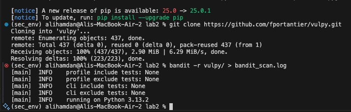

**Low Severity Issue:**

```log
--------------------------------------------------
>> Issue: [B110:try_except_pass] Try, Except, Pass detected.
   Severity: Low   Confidence: High
   CWE: CWE-703 (https://cwe.mitre.org/data/definitions/703.html)
   More Info: https://bandit.readthedocs.io/en/1.8.3/plugins/b110_try_except_pass.html
   Location: vulpy/bad/libsession.py:21:4
20	                session = json.loads(base64.b64decode(cookie))
21	    except Exception:
22	        pass
23	
```

**Explanation:**  
The code is catching an exception but does nothing (pass). This suppresses errors, making debugging harder and potentially allowing silent failures in security-related functions.  
**CWE-703** Improper Handling of Exceptional Conditions  
**Solution:** Instead of pass, log the error and handle it properly:
```python
    import logging
    try:
        session = json.loads(base64.b64decode(cookie))
    except Exception as e:
        logging.error(f"Error decoding session: {e}")
        raise  # Reraise exception for debugging
```

---

**Medium Severity Issue:**

```log
--------------------------------------------------
>> Issue: [B108:hardcoded_tmp_directory] Probable insecure usage of temp file/directory.
   Severity: Medium   Confidence: Medium
   CWE: CWE-377 (https://cwe.mitre.org/data/definitions/377.html)
   More Info: https://bandit.readthedocs.io/en/1.8.3/plugins/b108_hardcoded_tmp_directory.html
   Location: vulpy/bad/api_post.py:6:20
5	
6	api_key_file = Path('/tmp/supersecret.txt')
7	
```

**Explanation:**  
Storing sensitive files in /tmp/ is insecure because it is a world-writable directory, allowing unauthorized users to read, modify, or delete the file. Attackers can exploit this to access sensitive data or perform symlink attacks.  
**CWE-377** covers how improper handling of temporary files can lead to security risks.  
**Solution:** Use Python’s tempfile module to create secure temporary files or store sensitive data in a restricted directory with proper permissions.

---

**High Severity Issue:**

```log
--------------------------------------------------
>> Issue: [B201:flask_debug_true] A Flask app appears to be run with debug=True, which exposes the Werkzeug debugger and allows the execution of arbitrary code.
   Severity: High   Confidence: Medium
   CWE: CWE-94 (https://cwe.mitre.org/data/definitions/94.html)
   More Info: https://bandit.readthedocs.io/en/1.8.3/plugins/b201_flask_debug_true.html
   Location: vulpy/good/vulpy.py:53:0
52	
53	app.run(debug=True, host='127.0.1.1', port=5001, extra_files='csp.txt')
54	
```

**Explanation:**  
Running a Flask app with debug=True enables the Werkzeug debugger, which allows arbitrary code execution if an attacker gains access. This can lead to remote code execution and compromise the entire system.  
**CWE-94** covers how improper code execution can result in severe security risks.   
**Solution:** Don't use debug=True in production. Instead, set debug=False and use proper logging mechanisms for debugging.

---

### 1.2 Flawfinder (C)


```sh
pip install flawfinder
git clone https://github.com/hardik05/Damn_Vulnerable_C_Program.git
flawfinder Damn_Vulnerable_C_Program/ > flawfinder_scan.log
```

**Level 1 (Low Severity):**

```log
Damn_Vulnerable_C_Program/libAFL/damn_vulnerable_c_program_shmem/imgRead.c:35:  [1] (buffer) strlen:
  Does not handle strings that are not \0-terminated; if given one it may
  perform an over-read (it could cause a crash if unprotected) (CWE-126).
```

**Explanation:**  
The strlen function does not check if a string is **null-terminated**. If it encounters a non-null-terminated string, it may over-read memory, potentially causing crashes or exposing sensitive data.  
**CWE-126** refers to buffer over-read vulnerabilities, where a function reads beyond the allocated memory.   
**Solution:** Always ensure strings are properly null-terminated before using strlen, and use safer functions like strnlen to limit the read length.

---

**Level 2 (Medium Severity):**

```log
Damn_Vulnerable_C_Program/dvcp.c:16:  [2] (buffer) char:
  Statically-sized arrays can be improperly restricted, leading to potential
  overflows or other issues (CWE-119!/CWE-120). Perform bounds checking, use
  functions that limit length, or ensure that the size is larger than the
  maximum possible length.
```

**Explanation:**  
Statically-sized character arrays can lead to buffer overflows if input data exceeds the allocated size. Without proper bounds checking, this can cause memory corruption, crashes, or even arbitrary code execution.  
**CWE-119** covers improper memory restrictions, and CWE-120 specifically addresses buffer overflows.  
**Solution:**  Always validate input length before storing it in a fixed-size buffer, use strncpy or snprintf instead of unsafe functions like strcpy, and consider dynamically allocating memory when needed.

---

**Level 3 (Medium Severity):**
No issue related to level [3]

**False positive:**

```log
Damn_Vulnerable_C_Program/linux/imgRead_socket.c:74:  [1] (buffer) read:
  Check buffer boundaries if used in a loop including recursive loops
  (CWE-120, CWE-20).
```

**Explanation:**  
The warning for the read function in
Damn_Vulnerable_C_Program/linux/imgRead_socket.c:74
may be a false positive if the code already ensures that the buffer boundaries are properly checked before each read operation. The tool flags it for potential buffer overflow (CWE-120) and improper input validation (CWE-20).

### 1.3 njsscan (NodeJS)

**[Link to njsscan logs of scanning](https://github.com/Mohammed-Nour/secure-system-development/blob/main/lab2/logs/njsscan_scan.log)**

```sh
pip install njsscan
git clone git@github.com:appsecco/dvna.git
njsscan dvna/
```

**INFO Severity:**


**Explanation:**  
Not setting a maxAge for session cookies means sessions may persist indefinitely, allowing attackers more time to hijack active sessions.   
**CWE-613** relates to insufficient session expiration, where sessions do not terminate as expected, increasing the risk of unauthorized access.   
**Solution:** Configure the session cookie with an appropriate maxAge to ensure sessions expire after a defined period, thereby limiting the window for potential attacks.

---

**WARNING Severity:**


**Explanation:**  
Untrusted user input passed into the Express res.render() function may allow an attacker to manipulate file paths, potentially leading to arbitrary file reads via relative path traversal. This can expose sensitive data or configuration files.  
**CWE-23**  addresses relative path traversal vulnerabilities, which occur when user-supplied input is used to construct file paths without proper validation.  
**Solution:** Sanitize and validate all user inputs used in file path constructions, and implement strict whitelisting for acceptable file paths to prevent traversal attacks.

---

**ERROR Severity:**


**Explanation:**  
The code unserializes user-supplied data from req.files.products.data.toString('utf8') without proper validation, which can allow an attacker to inject malicious objects and potentially execute arbitrary code.  
**CWE-502** pertains to the deserialization of untrusted data, which can lead to object injection or remote code execution if the data is not properly validated and sanitized.  
**Solution:** Validate and sanitize the input data before deserialization or use secure deserialization methods that enforce strict type checks to prevent injection of malicious objects.

## Task 2 - Web Security Mini Labs

### 1. Install BurpSuite (Community Edition)

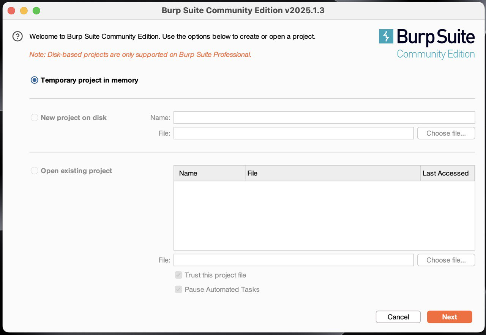

---

### 2. Running Vulnerable Applications

#### 2.1 Cross-Site Scripting (XSS)

##### Running the XSS image

```bash
docker run -p 127.0.0.1:5000:5000 sh3b0/vuln:xss
```

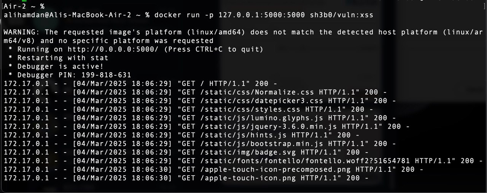

##### Injecting a script

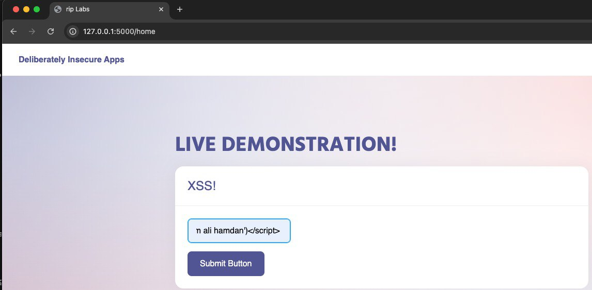

##### Results of injection

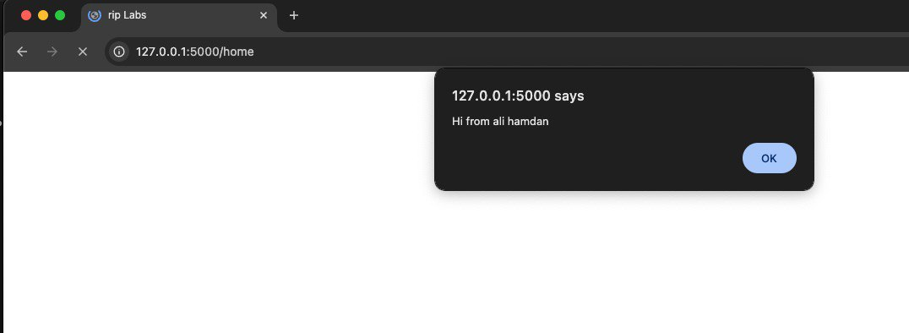

##### Captured in Burp Suite

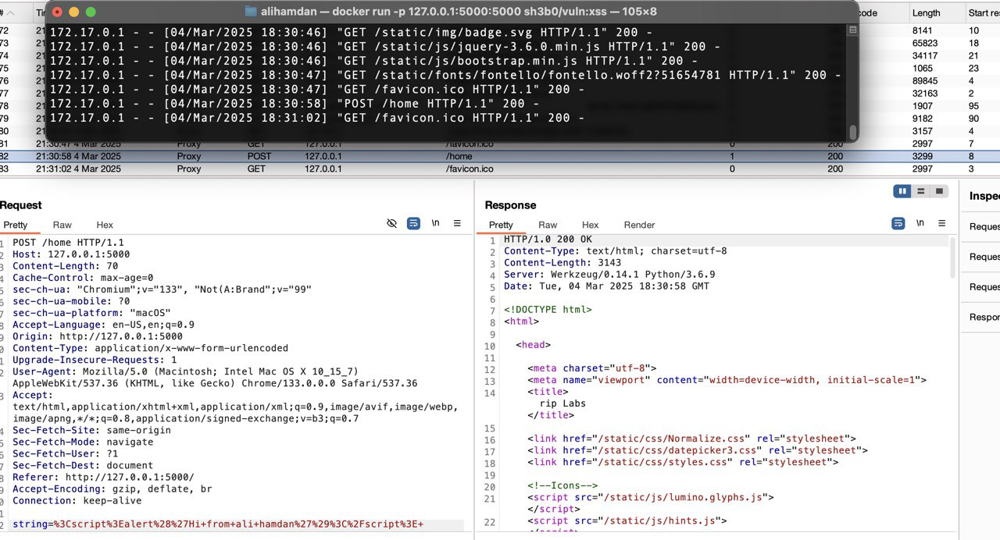

**Why XSS is Dangerous:**
XSS (Cross-Site Scripting) attacks enable attackers to inject malicious scripts into web pages, which are then executed in the browsers of unsuspecting users. This can lead to session hijacking, credential theft, and the manipulation of page content, undermining user trust and compromising sensitive data.
CWE-79 relates to XSS vulnerabilities.  
Solution: Employ input validation and output encoding to sanitize user data, implement Content Security Policies (CSP), and use secure frameworks that auto-escape outputs. These best practices help prevent malicious script injection and protect user data.

---

#### 2.2 Path Traversal

##### Running the path traversal image

```bash
docker run -p 127.0.0.1:5000:5000 sh3b0/vuln:path-traversal
```

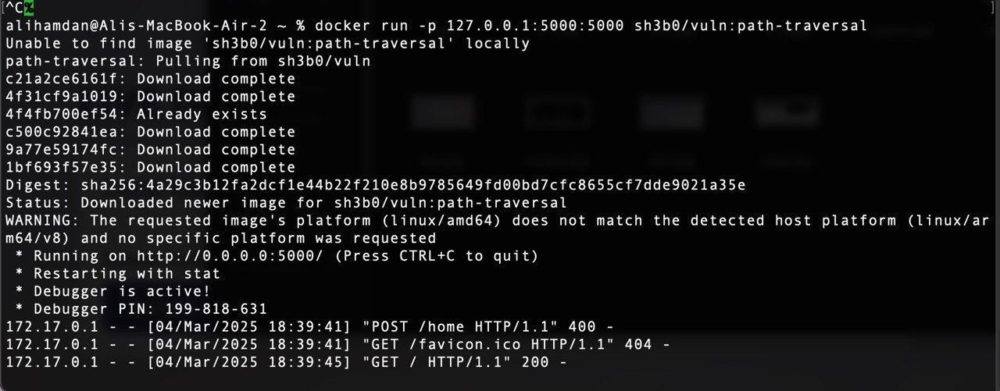

##### Exploiting path traversal by modifying a request

Changing the value to `../../../../etc/passwd`

##### After submitting

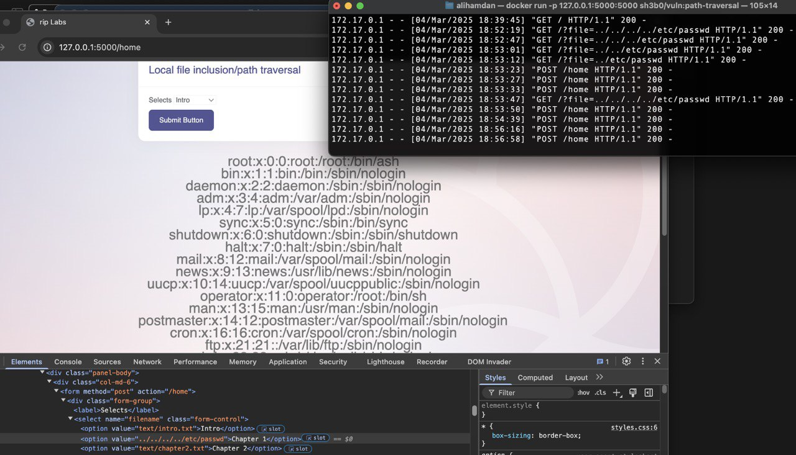

##### Captured in Burp Suite-1

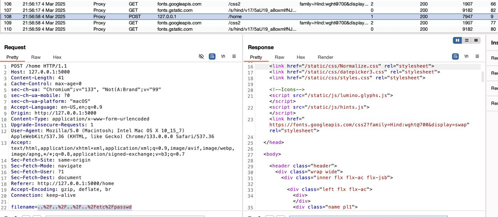

**Why Path Traversal is Dangerous:**
Path traversal vulnerabilities let attackers manipulate file paths to access restricted files, exposing sensitive data or compromising the system.  
Solution: Sanitize file path inputs, restrict access to approved directories, and enforce strict file permissions.


---

#### 2.3 SQL Injection

##### Running the SQL Injection image

```bash
docker run -p 127.0.0.1:5000:5000 sh3b0/vuln:sql-injection
```


##### Attempting SQL Injection

Injecting `1 UNION SELECT * FROM users` into an input field.

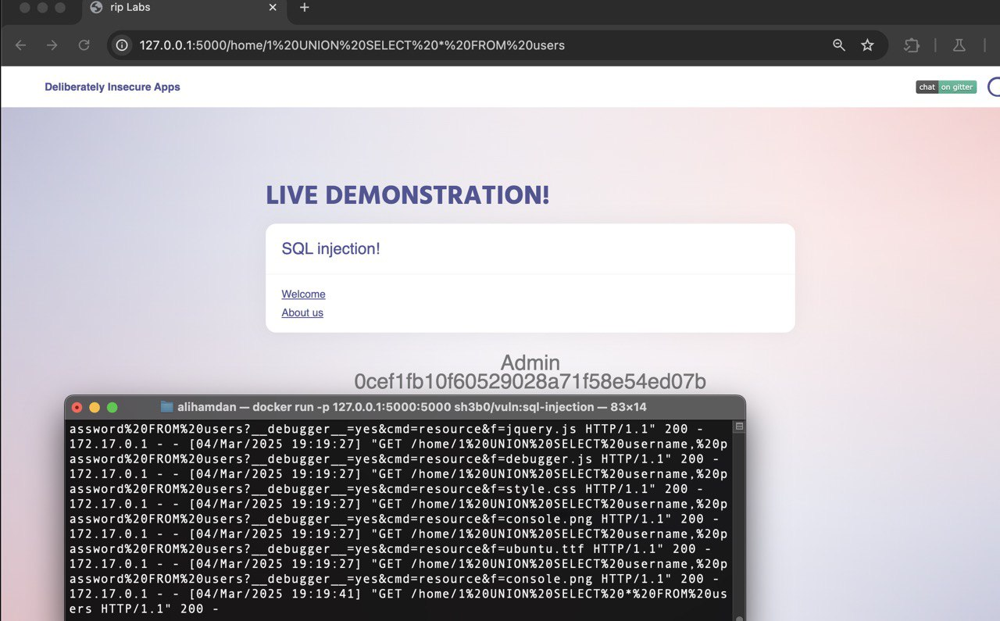

**Why SQL Injection is Dangerous:**
Explanation:
SQL Injection is dangerous because it lets attackers manipulate queries to access, modify, or delete sensitive data, potentially compromising the entire system.  
Solution:
Use parameterized queries, validate inputs, enforce least privilege, and perform regular security reviews.

---

#### 2.4 File Upload Exploit

##### Running the file upload image

```bash
docker run -p 127.0.0.1:5000:5000 sh3b0/vuln:file-upload
```

##### Bypassing file upload restrictions

Uploading an HTML file and intercepting the request in Burp Suite to modify the file path.

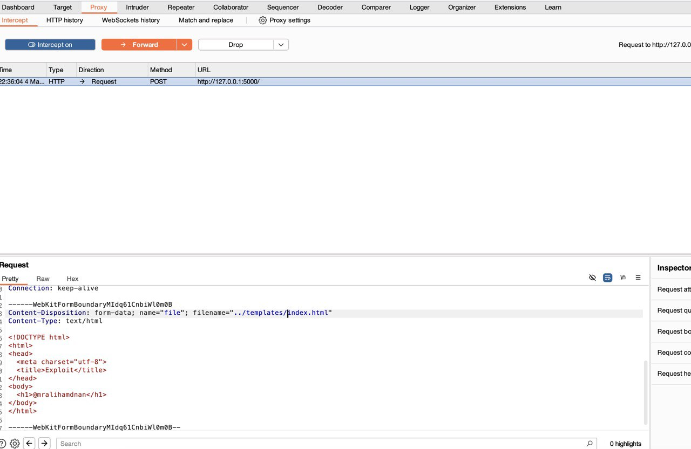


##### Results

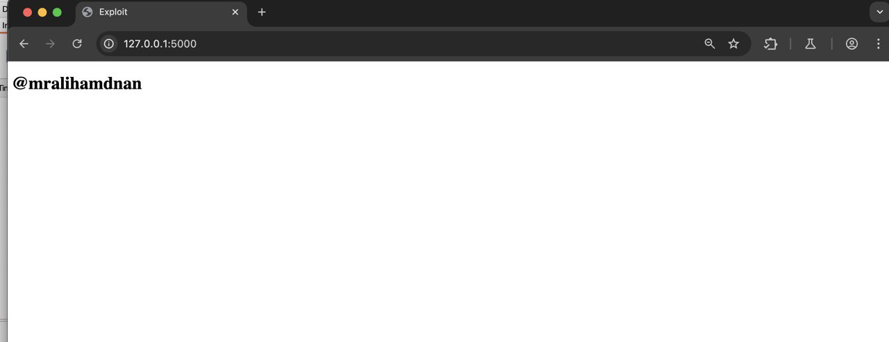


**Why Unrestricted File Upload is Dangerous:**
Explanation:
File upload vulnerabilities are dangerous because they enable attackers to upload malicious files, such as web shells, which can lead to remote code execution and unauthorized access.  
Solution:
Validate file types, sanitize filenames, store uploads outside the web root, and enforce file size limits to protect the system.

---

#### 2.5 Command Injection

##### Running the command injection image

```bash
docker run -p 127.0.0.1:5000:5000 sh3b0/vuln:command-injection
```

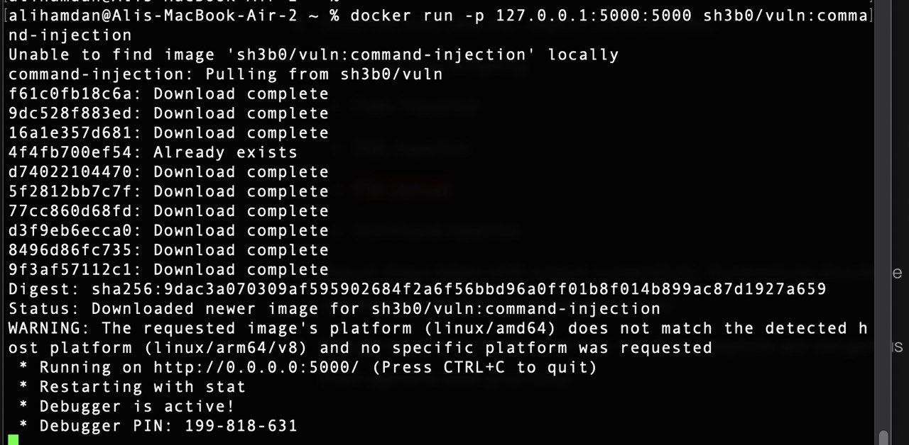

##### Injecting a command into an HTML element

Modifying a field to include:

```bash
50%; rm -rf /static/img/bones.jpg
```


##### After injection

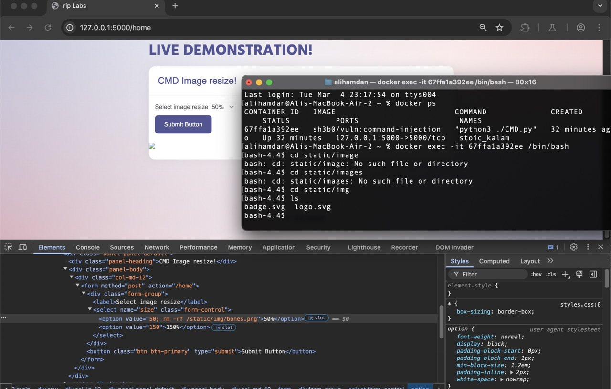


**Why Command Injection is Dangerous:**
Explanation:
Command injection vulnerabilities allow attackers to execute arbitrary system commands on the host server. This can lead to unauthorized access, data breaches, or full system compromise.

Solution: Validate and sanitize all user inputs, use parameterized APIs or libraries that avoid command concatenation, and enforce strict allow-listing of commands. Additionally, run services with the least privileges and isolate untrusted inputs to minimize potential damage.