# Lab 3 - Memory Safety

## Task 1 - Getting Started

### 1. Install GCC and Valgrind

- **GCC** was already installed on my device. I verified this using the command:

  ```bash
  gcc --version
  ```

- **Valgrind** was installed using the package manager:

  ```bash
  sudo apt install valgrind
  valgrind --version
  ```

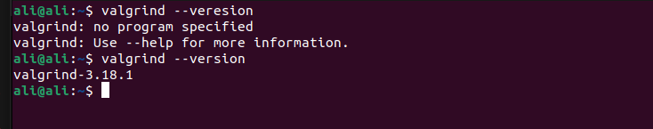


### 2. Create `program1.c`


### 3. Compile `program1.c`

The compilation command used is:

```bash
gcc -Wall -Werror -g -std=c99 -o program1 -O0 program1.c
```

**Explanation of Flags:**

- `-Wall`: Enables all warnings.
- `-Werror`: Treats all warnings as errors.
- `-g`: Adds debugging information.
- `-std=c99`: Uses the C99 standard.
- `-o program1`: Specifies the output file name.
- `-O0`: Disables optimizations.

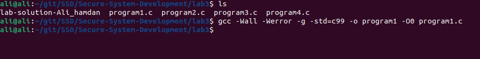

### 4. Run the Program

The program was executed using:

```bash
./program1
```

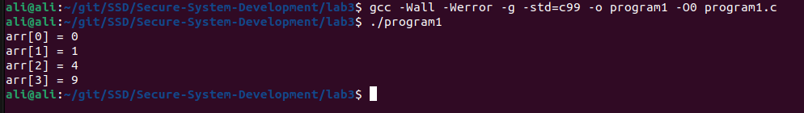

### 5. Run the Program with Valgrind

The program was executed with Valgrind using:

```bash
valgrind --leak-check=yes ./program1
```

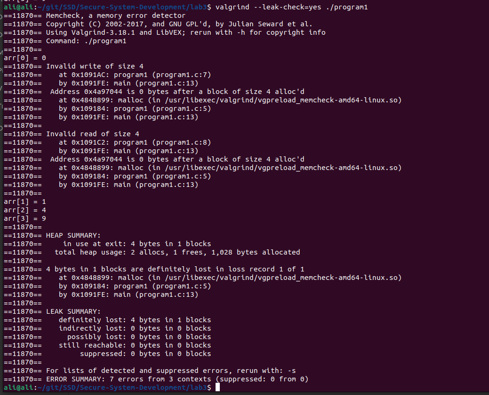

### 6. Analyze Valgrind Output

The Valgrind output indicates two main memory-related issues:

1. **Invalid Memory Access (Out-of-Bounds Write & Read)**  
   - The program attempts to write and read past the allocated memory (`0x4a97044 is 0 bytes after a block of size 4 alloc'd`).
   - The allocated size (4 bytes) suggests an `int` array of size **1** (`malloc(4)`), but the program accesses multiple elements (`arr[1]`, `arr[2]`, `arr[3]`).

   **CWE-787: Out-of-Bounds Write** – [MITRE Reference](https://cwe.mitre.org/data/definitions/787.html)  
   **CWE-125: Out-of-Bounds Read** – [MITRE Reference](https://cwe.mitre.org/data/definitions/125.html)

2. **Memory Leak**  
   - The program allocates memory but does not free it (`definitely lost: 4 bytes`).
   - Every `malloc` should have a corresponding `free`.

   **CWE-401: Memory Leak** – [MITRE Reference](https://cwe.mitre.org/data/definitions/401.html)

### 7. Propose Fixes

- **Fix the Memory Leak:** Add a `free` call after the `malloc` call.
- **Fix the Out-of-Bounds Access:** Ensure the array index is within the allocated size.

### 8. Verify Fixes

After applying the fixes, the program was recompiled and run with Valgrind:

```bash
gcc -Wall -Werror -g -std=c99 -o program1 -O0 program1.c
valgrind --leak-check=yes ./program1
```

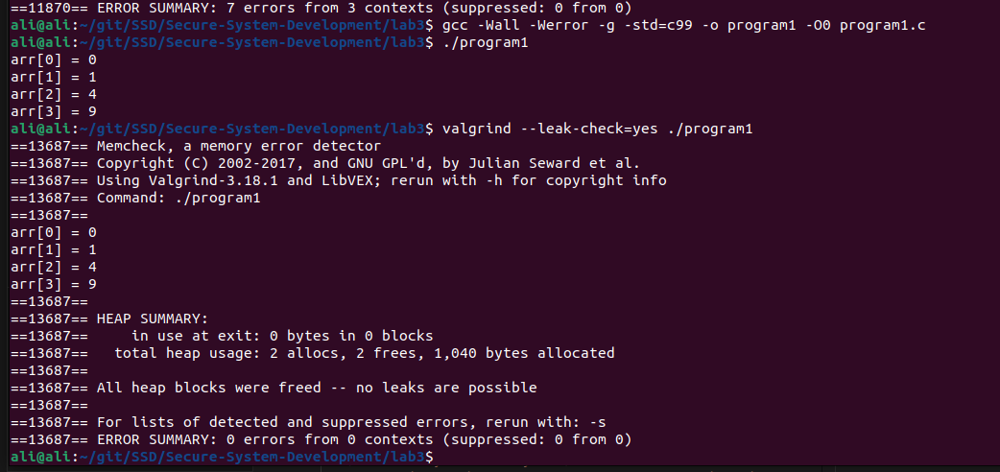

[Updated program1.c](https://github.com/Ali12hamdan/secure-system-development/blob/main/lab3/programs/program1.c)

---

## Task 2 - More Programs

### Program 2

#### 1. Create `program2.c`


#### 2. Compile with the following command `program2.c`

```bash
gcc -Wall -Werror -g -std=c99 -o program2 -O0 program2.c
```

The program was compiled and run with Valgrind:


#### 3. Run the program with the following command `program2.c`

```bash
./program2
```

- we running it, it doesn't give the correct ouptut

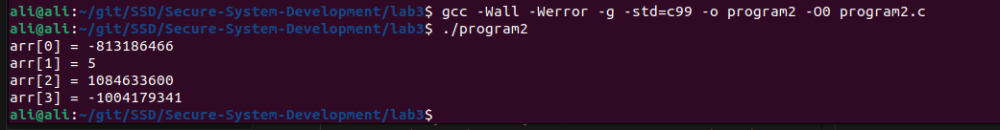

#### 4.  Run the program again with valgrind `program2.c`

```bash
valgrind --leak-check=yes ./program2
```

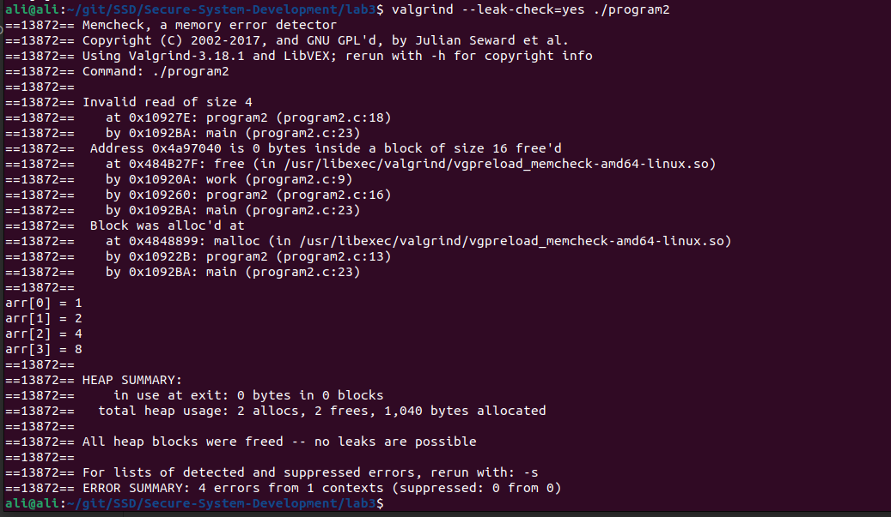

#### 5. Analyze Valgrind Output `program2.c`

1. **Use-After-Free**  
   - The program accesses memory (`arr[0]`, etc.) after it has been freed (`Address 0x4a97040 is 0 bytes inside a block of size 16 free'd`).  

   **CWE-416: Use After Free** – [MITRE Reference](https://cwe.mitre.org/data/definitions/416.html)

#### 6. Propose Fixes `program2.c`

- **Fix:** Move the `free` call after the loop that prints the array.

#### 7. Verify Fixes `program2.c`

After applying the fixes, the program was recompiled and run with Valgrind:

```bash
gcc -Wall -Werror -g -std=c99 -o program2 -O0 program2.c
./program2
valgrind --leak-check=yes ./program2
```

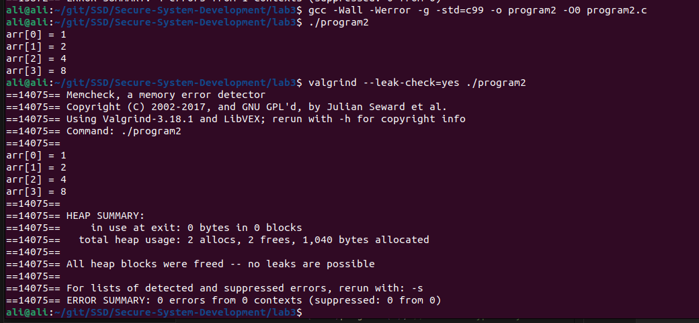

#### 8. Different output with Valgring and without it

- Without Valgrind, the OS may reuse freed memory, leading to incorrect output. Valgrind delays memory reuse, so values may still appear correct. The issue is **use-after-free**, causing undefined behavior. The fix is to free memory **after** using it.

[Updated program2.c](https://github.com/Ali12hamdan/secure-system-development/blob/main/lab3/programs/program2.c)

---

### Program 3

#### 1. Create `program3.c`


#### 2. Compile with the following command `program3.c`

```bash
gcc -Wall -Werror -g -std=c99 -o program3 -O0 program3.c
```

The program was compiled and run with Valgrind:

#### 3. Run the program with the following command `program3.c`

```bash
./program3
```

- we running it

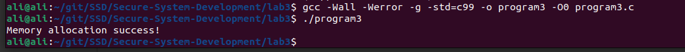

#### 4.  Run the program again with valgrind `program3.c`

```bash
valgrind --leak-check=yes ./program3
```

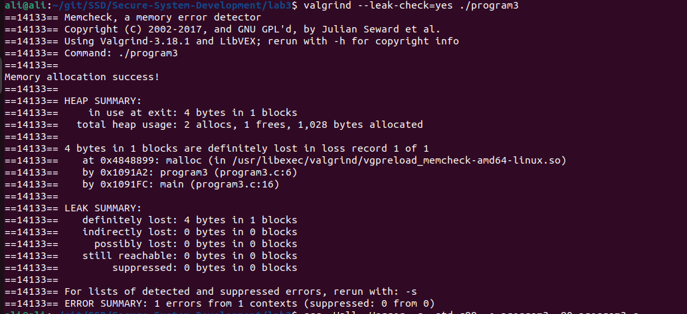

#### 5. Analyze Valgrind Output `program3.c`

1. **Memory Leak**  
   - The program allocates memory but does not free it (`definitely lost: 4 bytes`).  

   **CWE-401: Memory Leak** – [MITRE Reference](https://cwe.mitre.org/data/definitions/401.html)

#### 6. Propose Fixes `program3.c`

- **Fix:** Correct the condition in the `if` statement to check for `arr == NULL` instead of `arr = NULL`.

#### 7. Verify Fixes `program3.c`

After applying the fixes, the program was recompiled and run with Valgrind:

```bash
gcc -Wall -Werror -g -std=c99 -o program3 -O0 program3.c
./program3
valgrind --leak-check=yes ./program3
```

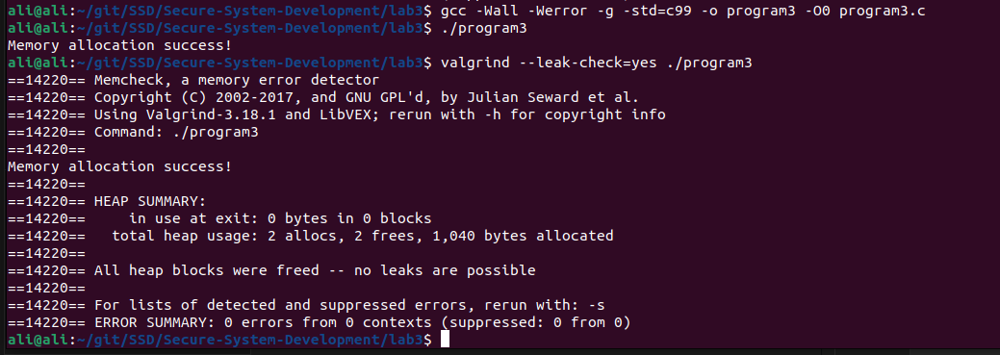

[Updated program3.c](https://github.com/Ali12hamdan/secure-system-development/blob/main/lab3/programs/program3.c)

---

### Program 4

#### 1. Create `program4.c`


#### 2. Compile with the following command `program4.c`

```bash
gcc -Wall -Werror -g -std=c99 -o program4 -O0 program4.c
```

The program was compiled and run with Valgrind:


#### 3. Run the program with the following command `program4.c`

```bash
./program4
```

- we running it

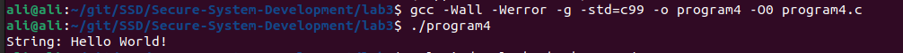

#### 4.  Run the program again with valgrind `program4.c`

```bash
valgrind --leak-check=yes ./program4
```

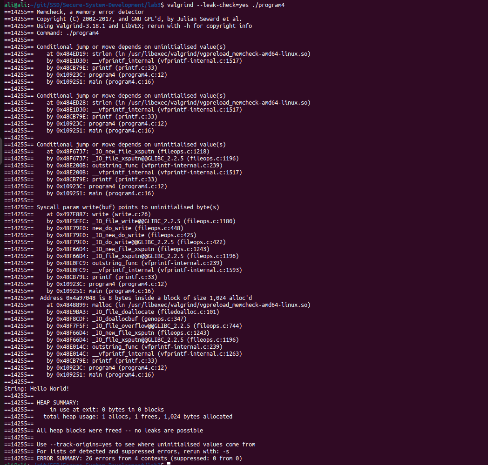

#### 5. Analyze Valgrind Output `program4.c`

1. **Use of Uninitialized Variable**  
   - The program uses an uninitialized value in a conditional jump.  

   **CWE-457: Use of Uninitialized Variable** – [MITRE Reference](https://cwe.mitre.org/data/definitions/457.html)  

2. **Uninitialized Memory Access**  
   - The program reads uninitialized memory before writing output.  

   **CWE-119: Improper Restriction of Operations within the Bounds of a Memory Buffer** – [MITRE Reference](https://cwe.mitre.org/data/definitions/119.html)

#### 6. Propose Fixes `program4.c`

- **Fix:** The issue in the original code is returning a pointer to a local stack variable, which leads to **undefined behavior**. Instead of using a local array, allocate memory dynamically on the heap using `malloc`.  
- **Safer Fix:** Use `malloc` to allocate memory and `strncpy` to safely copy the string, ensuring memory is properly managed.  
- **Ensure** the allocated memory is freed after use to prevent memory leaks.

#### 7. Verify Fixes `program4.c`

After applying the fixes, the program was recompiled and run with Valgrind:

```bash
gcc -Wall -Werror -g -std=c99 -o program4 -O0 program4.c
./program4
valgrind --leak-check=yes ./program4
```

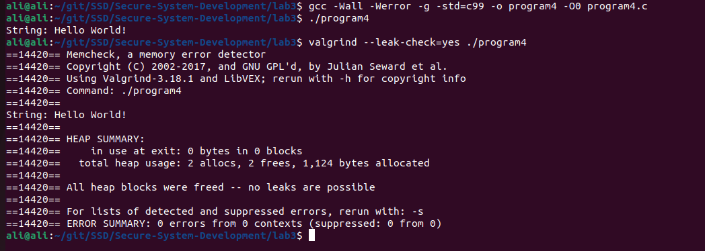

[Updated program4.c](https://github.com/Ali12hamdan/secure-system-development/blob/main/lab3/programs/program4.c)

---

## Task 3 - Vulnerable HashMap Library

### 1. Identify and Fix CWEs

# Vulnerable HashMap Library - Analysis & Fixes

## Identified Vulnerabilities & Fixes

### 1. **CWE-787: Out-of-Bounds Write (Array Indexing Issue)**
- **Issue:** `HashIndex()` does not constrain the index within `MAP_MAX`, potentially causing out-of-bounds writes.
- **Fix:** Use modulo operation to ensure valid indexing:
    ```c
    return sum % MAP_MAX;
    ```

---

### 2. **CWE-125: Out-of-Bounds Read (Invalid String Iteration in `HashIndex`)**
- **Issue:** The loop inside `HashIndex()` uses:
    ```c
    for (char* c = key; c; c++) { ... }
    ```
  - This mistakenly treats `c` as an address instead of iterating over characters.
- **Fix:** Properly iterate over the string:
    ```c
    int sum = 0;
    for (const char* c = key; *c != '\0'; c++) {
        sum += *c;
    }
    return sum % MAP_MAX;
    ```

---

### 3. **CWE-416: Use-After-Free (`HashDelete` Incorrectly Manipulates List)**
- **Issue:** `HashDelete()` does not `free()` the removed `PairValue`, leading to a memory leak.
- **Fix:** Proper memory deallocation:
    ```c
    free(val);
    ```

---

### 4. **CWE-401: Memory Leak (HashMap Initialization)**
- **Issue:** `HashInit()` does not initialize the array, leading to potential invalid memory accesses.
- **Fix:** Initialize `data` to `NULL`:
    ```c
    HashMap* map = malloc(sizeof(HashMap));
    if (map == NULL) {
        perror("Memory allocation failed");
        exit(EXIT_FAILURE);
    }
    memset(map->data, 0, sizeof(map->data));
    ```

---

### 5. **CWE-119: Improper Memory Handling in `HashAdd`**
- **Issue:** Overwrites existing values without properly handling memory.
- **Fix:** Allocate memory dynamically for new pairs.

---

### 6. **CWE-134: Uncontrolled Format String (Unsafe `printf`)**
- **Issue:** The following code in `HashDump()` can lead to format string attacks:
    ```c
    printf(val->KeyName);
    ```
- **Fix:** Use a safe format string:
    ```c
    printf("%s\n", val->KeyName);
    ```

---


### 2. Implement Improvements

- Refer to [Secure Coding Guidelines](https://securecoding.cert.org/) for best practices.
- Updated code can be found in the repository: [Updated hash.c](https://github.com/Ali12hamdan/secure-system-development/blob/main/lab3/programs/hash.c)

### 3. Verify Fixes

The code was compiled and run with Valgrind to ensure no memory-related issues were present.

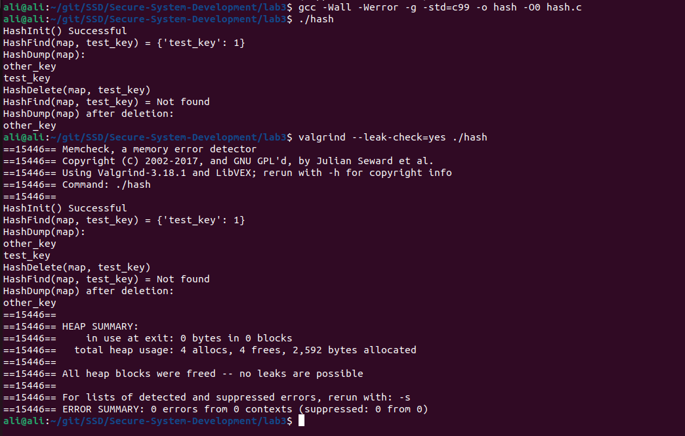